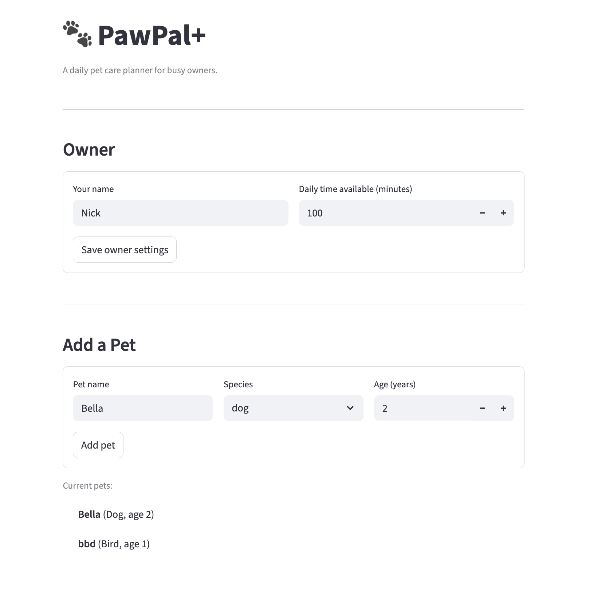
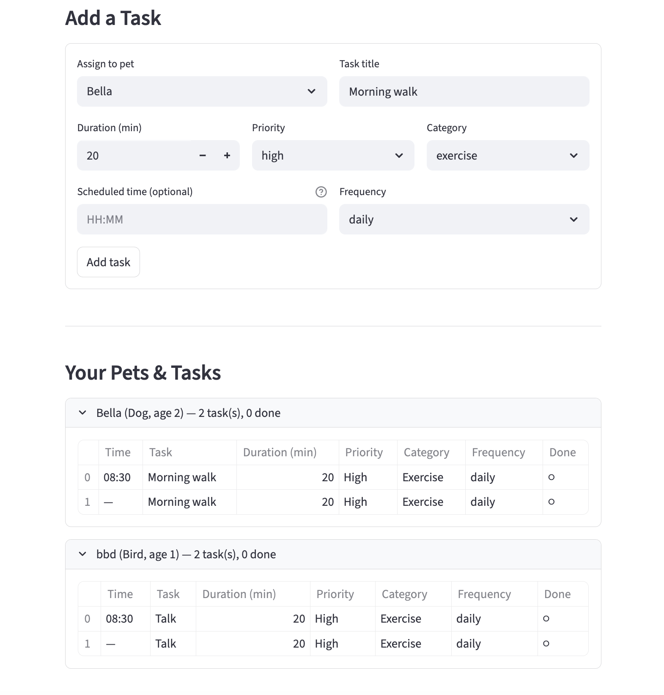
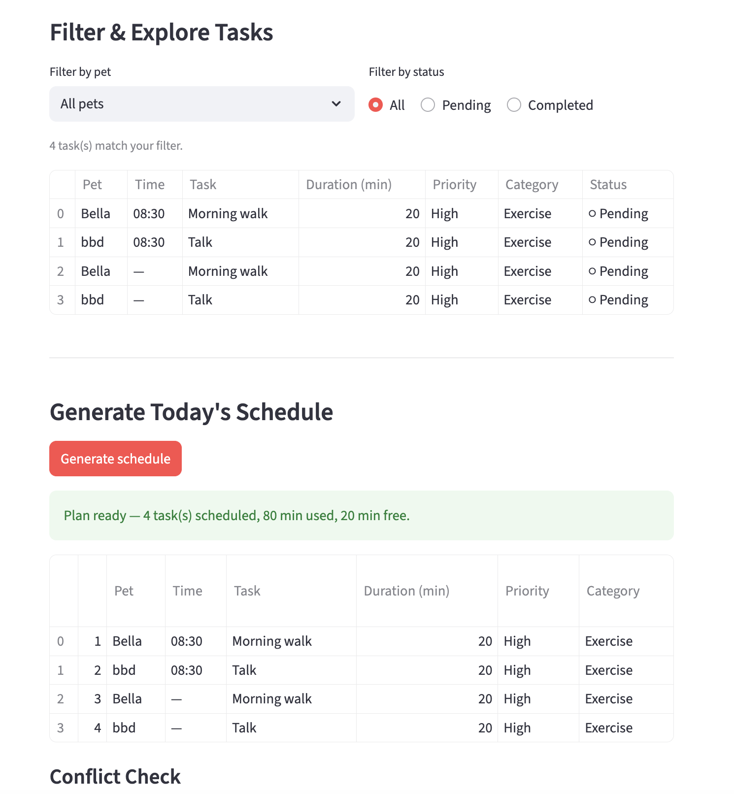
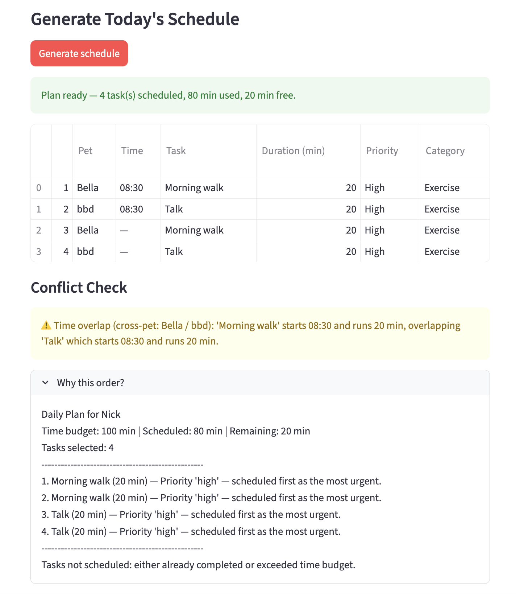

# PawPal+

**A daily pet care planner for busy owners.**

PawPal+ helps pet owners stay on top of every feeding, walk, grooming session, and vet appointment — no matter how hectic the day gets. Add your pets and their care tasks, set your available time, and let PawPal+ build an optimised daily schedule with plain-English reasoning and automatic conflict warnings.

---

## Features

### Intelligent Priority-Based Scheduling

PawPal+ ranks tasks by urgency before fitting them into your day. High-priority tasks (medications, feeding) are always scheduled first. Within the same priority tier, shorter tasks are placed ahead of longer ones — maximising the number of care items completed when time is tight. The scheduler explains every decision in plain language so owners understand exactly why the plan looks the way it does.

### Task Sorting by Time

Any task can be assigned an optional start time (`HH:MM`). The app sorts your task list chronologically so you always see the day's activities in the order they should happen. Tasks without a fixed start time are placed at the end, giving structured tasks priority in the view without hiding flexible ones.

### Filtering and Exploration

Quickly zero in on what matters using two independent filters:

- **Filter by pet** — see only the tasks belonging to a specific animal.
- **Filter by status** — switch between All, Pending, and Completed views in one click.

Both filters work together so you can ask, for example, "what has Bella still got to do today?" at a glance.

### Recurring Task Automation

Mark a daily or weekly task as complete and PawPal+ automatically queues the next occurrence — no manual re-entry required. One-off tasks are simply marked done and removed from the pending list. The recurrence engine calculates the correct next due date using `datetime.timedelta`, keeping the care schedule perpetually up to date without any extra effort from the owner.

### Conflict Detection with Warnings

After every schedule generation, PawPal+ scans the plan for three types of problem and surfaces them as plain-language warnings:

| Warning type | What it catches |
|---|---|
| **Budget overflow** | Total scheduled minutes exceed your daily time limit |
| **Unschedulable task** | A single task is longer than your entire daily budget and can never be selected |
| **Time overlap** | Two tasks have intersecting time windows and cannot both run as planned |

Overlap warnings name both tasks and their pets — `cross-pet: Bella / bbd` or `same pet: Bella` — so it is immediately clear whether a conflict is within one animal's routine or spans multiple pets.

---

## Screenshots

### Owner Setup and Pet Registration



Enter your name and daily time budget, then register as many pets as you like. Each pet tracks its own task list independently.

---

### Adding Tasks



Assign a task to any pet with a title, duration, priority, category, optional start time, and recurrence frequency. Your full pet-and-task roster is shown below the form, grouped by pet with a live task count.

---

### Filtering and Schedule Generation



Filter tasks by pet or completion status before generating the schedule. Hit **Generate schedule** and PawPal+ fits as many tasks as possible into your time budget, displaying the result as a sortable table with a summary banner.

---

### Conflict Check and Plan Explanation



Any time-window overlaps or budget issues appear as amber warnings directly below the schedule. Expand **Why this order?** to read a step-by-step explanation of the scheduling rationale — including time used, time remaining, and the reason each task was ranked where it is.

---

## Getting Started

### Prerequisites

- Python 3.10 or later
- pip

### Setup

```bash
python -m venv .venv
source .venv/bin/activate   # Windows: .venv\Scripts\activate
pip install -r requirements.txt
```

### Run the app

```bash
streamlit run app.py
```

---

## Project Structure

```
pawpal_system.py   — Core domain classes: Task, Pet, Owner, Scheduler
app.py             — Streamlit UI
tests/
  test_pawpal.py   — Automated test suite (18 tests)
diagram.md         — UML class diagram (updated to match final implementation)
```

---

## Running the Tests

```bash
python -m pytest tests/test_pawpal.py -v
```

### What the test suite covers

18 pytest functions across five areas:

| Area | Tests |
|---|---|
| **Task sorting** | Chronological order is correct for mixed `HH:MM` values; tasks with no time sort last |
| **Recurring tasks** | Daily tasks recur +1 day, weekly tasks recur +7 days, one-off tasks produce no follow-up; new occurrence is appended to the pet's task list |
| **Conflict detection** | Same-pet time overlaps are flagged; cross-pet overlaps are labelled `cross-pet`; tasks that exceed the daily budget are reported as unschedulable; non-overlapping tasks produce zero warnings |
| **Edge cases** | Pet with no tasks, owner with no pets, all tasks already completed, duplicate task IDs silently ignored |
| **Filtering** | `filter_by_pet` returns only the correct pet's tasks; unknown pet name returns an empty list |

### Confidence level

**★★★★☆ (4 / 5)**

The core scheduling behaviours — sorting, recurrence, conflict detection, and filtering — are each covered by multiple targeted tests, and all 18 pass. The rating stops short of 5 stars because the tests run against in-memory objects only; there is no coverage of the Streamlit UI layer, persistent storage, or edge-case user inputs such as malformed `HH:MM` strings or out-of-range priorities.

---

## System Design

The full UML class diagram is in [diagram.md](diagram.md). Key design decisions:

- **Owner aggregates tasks through pets** — there is no separate owner-level task list; `Owner.get_all_tasks()` and `Owner.get_pending_tasks()` traverse the pet roster dynamically.
- **Composition over aggregation** — pets and their tasks are deleted together with the owner; tasks belong unambiguously to one pet.
- **Conflict warnings are data, not exceptions** — `detect_conflicts()` returns a plain list of strings so the UI can decide how to display them without try/except boilerplate.
