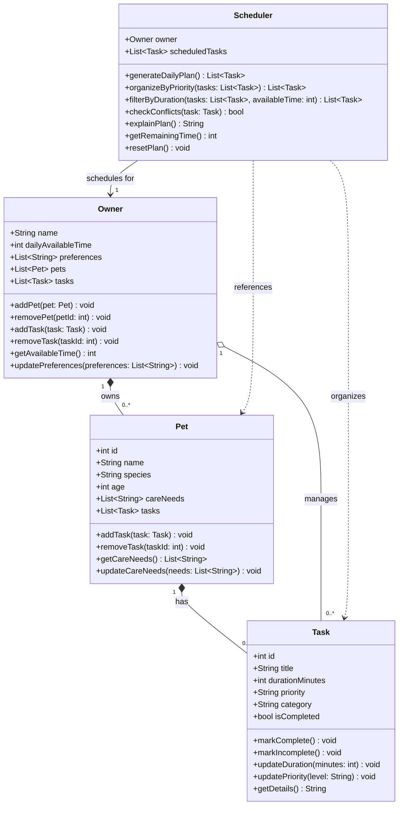

# PawPal+ — Class Diagram

## Relationship Key

| Symbol | Meaning |
|--------|---------|
| `*--`  | Composition — child cannot exist without parent |
| `o--`  | Aggregation — owner holds a reference to tasks |
| `-->`  | Association — scheduler is linked to one owner |
| `..>`  | Dependency — scheduler reads pets/tasks but does not own them |

## Notes

- **Owner → Pet** (composition, 1 to 0..*): Pets belong to one owner and are removed if the owner is deleted.
- **Pet → Task** (composition, 1 to 0..*): Tasks are tied to a specific pet's care needs.
- **Owner → Task** (aggregation, 1 to 0..*): Owner also holds a master task list for cross-pet scheduling and non-pet tasks (e.g., "buy supplies").
- **Scheduler → Owner** (association): The scheduler is initialized with an owner and uses their available time and preferences to build the plan.
- **Scheduler → Pet / Task** (dependency): The scheduler reads these during `generateDailyPlan()` but does not own or store them directly.
