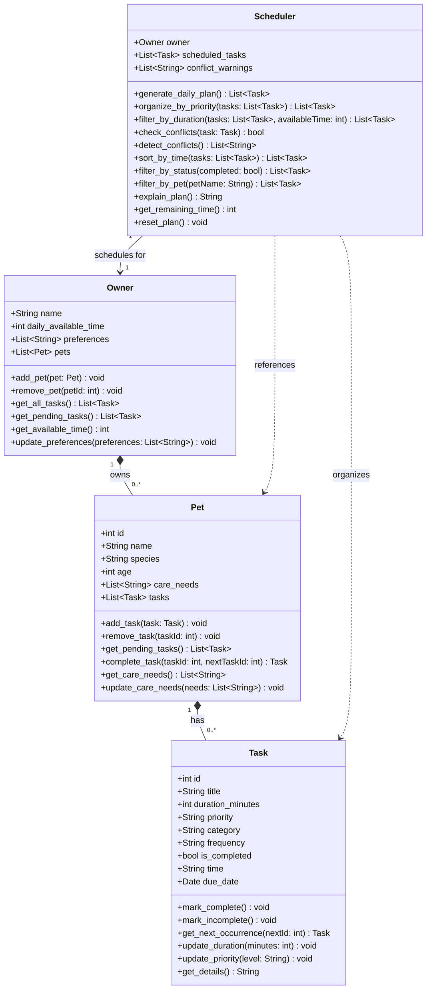

# PawPal+ — Class Diagram

## Relationship Key

| Symbol | Meaning |
|--------|---------|
| `*--`  | Composition — child cannot exist without parent |
| `o--`  | Aggregation — owner holds a reference to tasks |
| `-->`  | Association — scheduler is linked to one owner |
| `..>`  | Dependency — scheduler reads pets/tasks but does not own them |

## Notes

- **Owner → Pet** (composition, 1 to 0..*): Pets belong to one owner and are removed if the owner is deleted. Owner accesses all tasks indirectly through its pets via `get_all_tasks()` and `get_pending_tasks()` — there is no separate owner-level task list.
- **Pet → Task** (composition, 1 to 0..*): Tasks are tied to a specific pet. `complete_task()` marks a task done and automatically appends the next recurrence for recurring tasks.
- **Task — recurring tasks**: The `frequency` field ("once", "daily", "weekly") drives `get_next_occurrence()`, which creates a new Task shifted by the appropriate time delta. This is triggered by `Pet.complete_task()`.
- **Scheduler → Owner** (association): The scheduler is initialized with an owner and uses their available time and preferences to build the plan.
- **Scheduler → Pet / Task** (dependency): The scheduler reads these during `generate_daily_plan()` but does not own or store them directly. After plan generation, `detect_conflicts()` runs automatically and populates `conflict_warnings` with budget overflow, unschedulable tasks, and time-window overlap issues.
